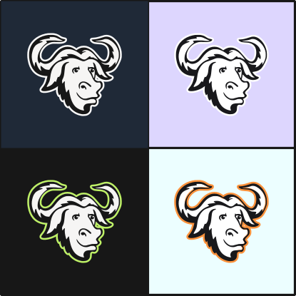

# gnu-30 logo

A logo for the LUG based on the [FSF's 30th anniversary](https://www.fsf.org/blogs/community/celebrate-gnus-big-three-o) web badge.

- License: [CC BY-SA 3.0](https://creativecommons.org/licenses/by-sa/3.0/deed.en)
- Font Family: [Lato](https://fonts.google.com/specimen/Lato)
- [SVG source](./source.svg)
- Software: [Inkscape](https://inkscape.org/)
- [Embroidery version](./GNU30NairobiLUGInkStitch.svg)
- Embroidery Software: [Ink/Stitch](https://inkstitch.org)

## Gallery 

## Notes
Some notes on colored/dark backgrounds

 - The fill can be any color as long as it&#39;s brighter than the background
 
 
 - The outline is necessary on dark mode. It can be any color and doesn't have to match the fill.
 
 

 - Inverting the colors does not work

 
 
 - Embroidery Preview

 
